# Rufus++ user guide

Rufus++ creates, verifies, formats, and captures removable boot media on
Windows, Linux, and macOS. Its interface follows the compact workflow of Rufus,
while the implementation uses a Qt front end, a portable media core, and a
native storage backend for each operating system.

> [!WARNING]
> Rufus++ is still a development prototype awaiting broad testing with physical
> removable media. Writing, formatting, and bad-block testing permanently erase
> data. Keep a backup, disconnect unnecessary drives, and verify the target's
> name and capacity in the final confirmation every time.

The screenshots in this guide were rendered from the application's real Qt
widgets. Device names, paths, image names, versions, hashes, capabilities, and
results shown in them are fictional documentation examples. Available controls
may differ by host, installed dependencies, detected image, target geometry,
and Windows version. Native styling also varies slightly between operating
systems.

## Contents

- [Install or build Rufus++](#install-or-build-rufus)
- [Privilege states](#privilege-states)
- [Before writing a device](#before-writing-a-device)
- [Main-window tour](#main-window-tour)
- [Create boot media](#create-boot-media)
- [Image-specific workflows](#image-specific-workflows)
- [Drive and format controls](#drive-and-format-controls)
- [Tools](#tools)
- [Confirmation, progress, and records](#confirmation-progress-and-records)
- [Troubleshooting](#troubleshooting)
- [Current limitations](#current-limitations)

## Install or build Rufus++

### Packaged development builds

The automated build produces these self-contained application packages:

| Host | Architecture | Package |
| --- | --- | --- |
| Windows | x86-64 | Portable ZIP |
| Linux | x86-64 | Portable tar.gz |
| macOS | Apple Silicon (ARM64) | DMG |
| macOS | Intel (x86-64) | DMG |

Download the package for the host architecture, verify its published SHA-256
checksum, and extract or mount it. If there is no published release yet, a
repository maintainer can produce an artifact with **Actions → Build
Development → Run workflow**. See [Automated builds and releases](releases.md)
for the maintainer workflow.

The current macOS DMGs are unsigned-root development builds. They are intended
for controlled field testing, not general distribution, and may require the
usual macOS override for an unsigned application.

### Build from source

Install CMake 3.24 or later, a C++17 compiler, Qt 6.5 or later with Widgets and
Network, and the development packages for zlib, libbz2, liblzma, and libzstd.
From the repository root, run:

```console
cmake --preset dev
cmake --build --preset dev
ctest --preset dev
```

If Qt is not in a standard prefix:

```console
cmake --preset dev -DCMAKE_PREFIX_PATH=/path/to/Qt
```

The executable is under `build/dev/src/qt`. On macOS it is inside
`build/dev/src/qt/Rufus++.app`.

To create the explicit macOS unsigned-root development variant:

```console
cmake --preset dev -DRUFUSPP_MACOS_UNSIGNED_ROOT_MODE=ON
cmake --build --preset dev
sudo "build/dev/src/qt/Rufus++.app/Contents/MacOS/Rufus++"
```

Do not distribute that variant as a production security model. A production
macOS package is expected to use a signed, authenticated helper so the GUI can
remain unprivileged.

## Privilege states

The colored badge in the lower-right corner reports the active physical-device
access route. It is a runtime state, not a statement that every optional tool or
operation is available.

| Badge | Meaning | Physical-device writes |
| --- | --- | --- |
| `UNPRIVILEGED` (red) | No privileged transport is active | Disabled, or `AUTHORIZE` is offered where supported |
| `ELEVATED` (green) | The complete application is running as Administrator/root | Enabled after all target and provider checks pass |
| `PRIVILEGED HELPER` (blue) | The GUI is unprivileged and an authenticated helper handles disk access | Enabled after helper and target checks pass |

### Windows

Start Rufus++ normally for image analysis and read-only discovery. When a
physical operation needs Administrator access, `START` changes to `AUTHORIZE`.
Select it and approve the UAC prompt. Windows opens a separate elevated Rufus++
window; continue the operation in that window. The original window remains
`UNPRIVILEGED`.

### Linux

Read-only discovery and image analysis work without root. Physical writing,
capture, destructive testing, and some host formatting tools currently require
the complete application to be launched through a trusted administrator
mechanism. An integrated least-privilege Linux helper is not yet installed.

### macOS

A production configuration reports `PRIVILEGED HELPER` only when its signed
helper is correctly registered and available. An unsigned-root development
build reports `UNPRIVILEGED` when opened normally and `ELEVATED` only when its
bundle executable is launched with `sudo`. Opening that build normally is safe
for inspecting the interface and analyzing images, but it cannot modify a
physical disk.

## Before writing a device

Use this checklist for every destructive operation:

1. Back up every file on the intended target.
2. Disconnect removable drives that are not involved.
3. Obtain the image or installer from its publisher and verify the publisher's
   checksum or signature when one is available.
4. Connect the target directly rather than through an unreliable hub.
5. Check the target model and capacity in **Device**.
6. Review the partition scheme, firmware target, filesystem, format policy, and
   verification profile.
7. Read the final preflight details before accepting the destructive prompt.
8. Do not unplug the source or target until Rufus++ reports completion.

Rufus++ hides fixed and system disks by default. The advanced option can reveal
them for inspection, but protected devices remain ineligible for writing.

## Main-window tour

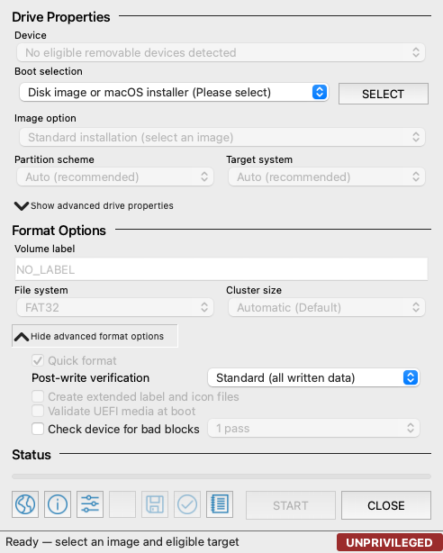

### Drive Properties

| Control | Purpose |
| --- | --- |
| **Device** | Selects an eligible whole removable device. Its identity is checked again immediately before destructive access. |
| **Boot selection** | Shows the analyzed image or, on macOS, an Apple installer application. |
| **SELECT** | Opens the host file picker and starts bounded source analysis. |
| **Image option** | Shows only strategies supported by the detected source, such as ISO mode, DD mode, Windows To Go, or Apple installer creation. |
| Settings button beside **Image option** | Opens the Windows customization dialog for Windows Setup or Windows To Go. It is hidden for unrelated images. |
| **Persistent partition size** | Appears only for a recognized Casper or Debian Live layout. The usable maximum is calculated from the selected target. |
| **Partition scheme** | Selects MBR or GPT when ISO-mode deployment permits a choice. |
| **Target system** | Selects legacy BIOS, UEFI, or dual BIOS + UEFI when supported. GPT ISO layouts are UEFI-only. |
| **Show advanced drive properties** | Reveals the inspection-only option to list fixed and system disks. |

### Format Options

| Control | Purpose |
| --- | --- |
| **Volume label** | Sets the new filesystem label where the selected deployment mode owns the filesystem. |
| **File system** | Selects FAT32 or NTFS for compatible ISO workflows. Raw images use their image-defined layout. |
| **Cluster size** | Selects a validated allocation unit or lets Rufus++ choose automatically. |
| **Quick format** | Keeps otherwise-unused target sectors intact where supported. Clear it to overwrite and verify unused space too. |
| **Post-write verification** | Chooses sampled, written-data, or complete-device verification. |
| **Validate UEFI media at boot** | Wraps supported UEFI fallback loaders with the bundled offline validator and writes a complete MD5 manifest. |
| **Check device for bad blocks** | Runs one to four destructive address-dependent write/read passes before deployment. |

### Status and toolbar

The progress bar reports source analysis, staging, writing, verification, and
completion. During a cancellable operation, **CLOSE** becomes **CANCEL**.

The lower-left toolbar is ordered as follows:

| Position | Tool |
| --- | --- |
| 1 | Language information |
| 2 | About Rufus++, version, asset licences, and packaged Secure Boot data version |
| 3 | Settings and Capability Health |
| 4 | Standalone format or blank boot media |
| 5 | Capture the selected drive to an image |
| 6 | Calculate checksums for the selected image |
| 7 | Show or hide the operation log |

## Create boot media

The normal workflow is:

1. Connect the removable target and choose it in **Device**.
2. Select **SELECT**, then choose an image. On macOS, a complete
   `Install macOS ….app` is also accepted.
3. Wait for `ANALYZED — READY`. The available controls are derived from the
   source's validated metadata rather than its filename alone.
4. Choose an **Image option** when more than one safe strategy is available.
5. Review the layout and format settings. Open the advanced panels if extra
   verification or testing is required.
6. Select **START**. If it reads **AUTHORIZE**, grant the platform's requested
   access and continue in the authorized application state.
7. Configure any gated Windows options that have not already been configured.
8. Read the destructive confirmation and expand **Show Details**.
9. Select **Yes** only when the source and target are correct.
10. Wait for completion, then use the operating system's safe-eject command.

The interface is content-wrapped and deliberately not freely resizable.
Expanding advanced properties or the log grows the window; collapsing them
returns it to the smallest size required by the visible controls.

## Image-specific workflows

### Standard Windows installation

Validated Windows installer media exposes **Standard Windows installation**.
Choose the required MBR/GPT and BIOS/UEFI combination, filesystem, cluster
size, format policy, and verification profile.

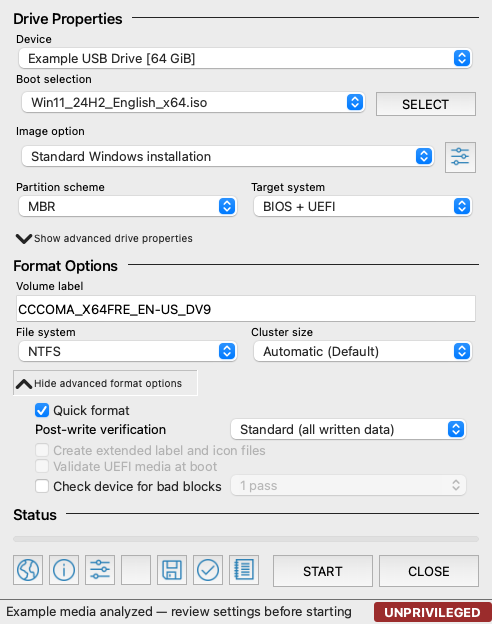

FAT32 deployment works across all hosts. If `install.wim` or `install.esd` is
too large for FAT32, Rufus++ uses wimlib to create validated split WIM parts.
Alternatively, an available NTFS staging provider can create an NTFS data
partition plus the bundled UEFI:NTFS helper partition. Missing dependencies
keep the operation disabled and appear in Capability Health.

Select the settings button beside **Image option** to open Windows User
Experience options:

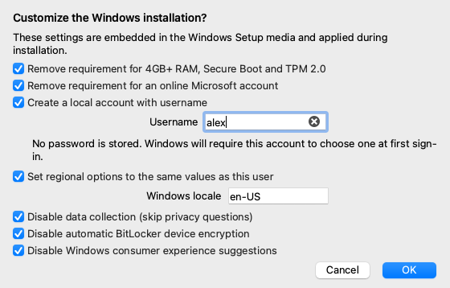

The exact checkboxes depend on the Windows build found in the image:

- The 4 GB RAM, Secure Boot, and TPM 2.0 bypass is shown for Windows 11 builds.
- The online Microsoft-account bypass is shown only for builds that use that
  setup requirement.
- Automatic BitLocker and consumer-experience controls appear on applicable
  Windows 11 builds.
- Local-account, locale, and privacy controls remain available where the
  generated unattended answer file supports them.

No password is requested, stored, embedded, or logged. A requested local
account chooses a password at first sign-in.

### Windows To Go

When the image contains usable Windows editions, **Windows To Go** appears as a
second image option. Rufus++ creates a portable GPT installation with an EFI
System Partition, Microsoft Reserved Partition, and NTFS Windows partition.

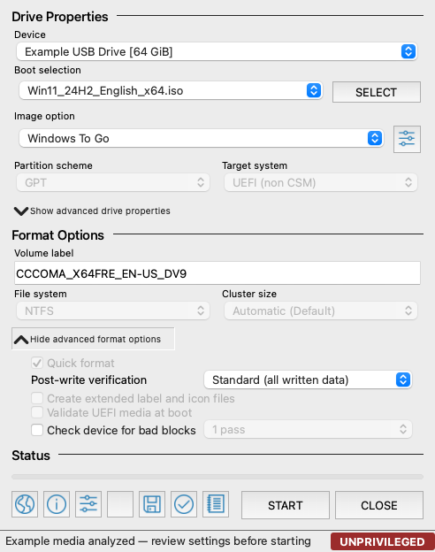

If the image contains multiple editions, choose one first:

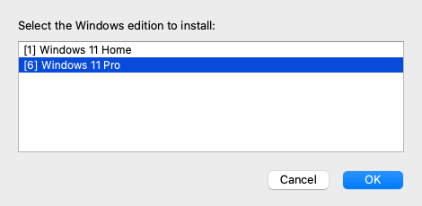

The Windows To Go customization dialog adds the option to keep the host's
internal disks offline by default:

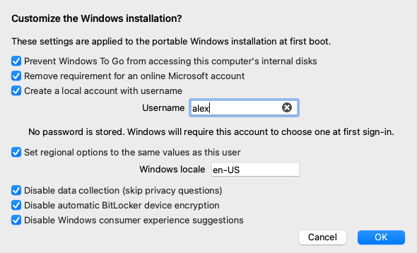

Windows To Go requires wimlib and a complete platform boot-staging toolchain.
Windows uses DiskPart and BCDBoot. Linux and macOS use their native image
attachment tools plus BCD-SYS and related dependencies. See
[Features and runtime requirements](features.md) for the complete list.

### Linux live media and persistence

A Linux image with a recognized Casper or Debian Live boot configuration can
show both **ISO image mode (file copy)** and **DD image mode**. ISO mode permits
a persistence partition; DD mode reproduces the image exactly and therefore
does not use the persistence control.

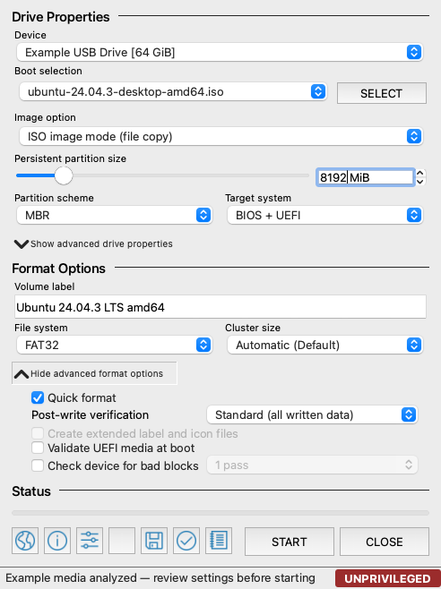

The persistence control has two independent gates:

1. Source analysis must find boot entries that can be patched safely.
2. A target must be selected so Rufus++ can calculate the remaining capacity
   after reserving 110% of the extracted live-image payload.

The slider is disabled or has no usable range when either condition is absent.
A value of zero creates ordinary live media. A nonzero value adds a verified
ext2 `casper-rw` partition for Ubuntu/Casper or a Debian `persistence`
partition with `/persistence.conf`, and patches only recognized boot entries.

Unknown or distribution-specific layouts are intentionally not guessed.
Tails, for example, keeps its native encrypted persistence workflow.

### Raw, virtual-disk, and compressed images

**DD image mode** performs an exact sector-for-sector deployment. It is used
for raw images and may be offered for hybrid ISOs. The source defines the
partition table and filesystem, so incompatible layout controls are disabled.

Rufus++ also accepts validated fixed VHD, parentless dynamic VHD, and
parentless dynamic VHDX images. Differencing images and active-log VHDX files
remain inspection-only. Gzip, Bzip2, single-payload ZIP, LZMA-alone, XZ, and
Zstandard images are decompressed while writing and verifying, without first
creating another full-size source image.

### FFU

Rufus++ validates Full Flash Update container structure on every host. Applying
or capturing FFU is available only on Windows through DISM. Linux and macOS can
inspect valid FFU metadata but cannot deploy it.

### macOS installer application

On macOS, select a complete Apple-signed `Install macOS ….app` rather than an
ISO. Rufus++ validates the bundle and its native
`Contents/Resources/createinstallmedia` tool, then exposes a distinct
installer workflow.

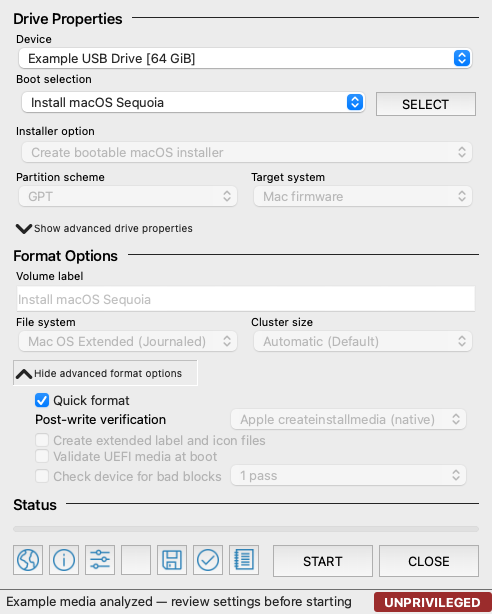

Apple owns the resulting GPT, Mac firmware, filesystem, and allocation-unit
choices, so those controls are locked. With **Quick format** selected, Apple
handles normal erasure and verification. Clearing it asks Rufus++ to zero-fill
and read-verify the entire target before invoking `createinstallmedia`.

This creates macOS installation media. It does not create a portable or live
macOS system. The target must be at least 16 GiB; 32 GB is recommended for
current installers.

## Drive and format controls

### Partition scheme and target system

- **MBR** supports compatible BIOS, UEFI, or dual-mode ISO layouts.
- **GPT** is constrained to UEFI for ISO-mode deployment.
- **Windows To Go** fixes GPT and UEFI.
- **macOS installer** fixes GPT and Mac firmware.
- **DD**, VHD/VHDX, compressed raw, and FFU operations use the image-defined
  layout.

The UI prevents contradictory choices. For example, selecting GPT in ISO mode
sets UEFI and disables the target-system control until MBR is selected again.

### Filesystem and cluster size

FAT32 is the portable default for compatible ISO deployment. NTFS is used when
the content requires it and a complete UEFI:NTFS provider is available.
Cluster-size entries are filtered and validated against the filesystem and the
target's logical sector size. **Automatic (Default)** is appropriate unless a
specific compatibility requirement calls for another allocation unit.

### Quick versus full format

Quick format writes the structures and source payload required by the selected
operation. Full format additionally overwrites and verifies otherwise-unused
target space. It is substantially slower and causes additional flash wear, but
is useful when qualifying suspect media or clearing stale content. Raw and FFU
deployment always follow the image-defined coverage.

Choosing **Full device** verification automatically requires a full format when
the selected workflow otherwise leaves unused target space.

### Verification profiles

| Profile | Behavior | Typical use |
| --- | --- | --- |
| **Fast (sampled)** | Compares deterministic beginning, end, and distributed payload samples | A quick development check |
| **Standard (all written data)** | Rereads and compares every byte Rufus++ wrote | Recommended default |
| **Full device** | Verifies the complete target | Full formatting or complete-device images |
| **Apple createinstallmedia (native)** | Uses Apple's normal installer-media finalization | Quick macOS installer workflow |
| **Full pre-wipe + Apple native** | Zero-fills and verifies first, then runs Apple's tool | Thorough macOS target qualification |

### Advanced options and operation log

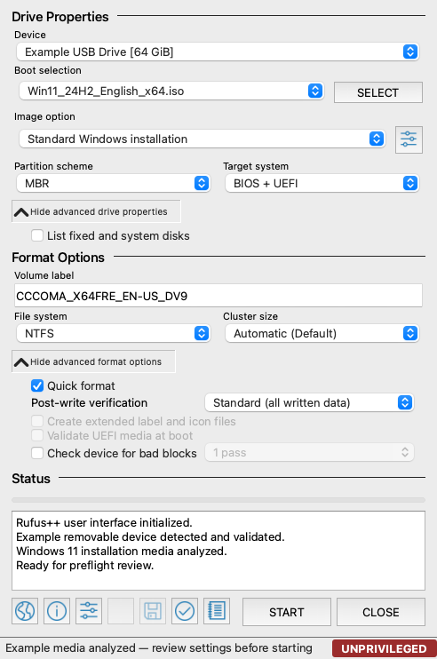

**List fixed and system disks** is for visibility and inspection; it does not
make a protected drive writable. The log records detection, decisions,
dependencies, warnings, progress, and completion information. It deliberately
does not record Windows account passwords because Rufus++ never requests one.

## Tools

### Standalone formatting and blank boot media

Select a device, then use the toolbar's format icon. The first dialog contains
only formats and boot payloads available for that target and host. This
documentation view shows the principal choices:

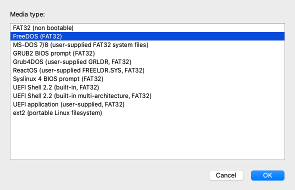

Portable options include FAT16 where target geometry permits it, FAT32, ext2,
FreeDOS, GRUB2, Syslinux 4, and the bundled UEFI Shell. MS-DOS, Grub4DOS,
ReactOS, and a generic UEFI application require user-supplied local files.
Host providers may add NTFS, UEFI:NTFS, exFAT, UDF, ReFS, or ext3.

For a single built-in UEFI Shell, choose the firmware architecture. The
multi-architecture option installs all bundled fallback executables.

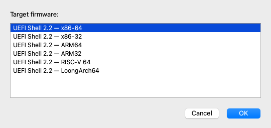

The bundled shell is integrity-checked and used entirely offline, but it is not
Microsoft Secure Boot signed. Disable Secure Boot on the machine that will boot
it. Rufus++ never downloads a shell or bootloader automatically.

### Capture a drive to an image

Select the source device and use the toolbar's save-device icon. Rufus++ offers
only capture providers available for the current platform and source:

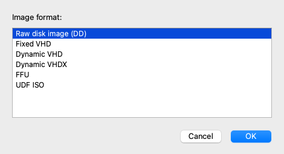

- Raw/DD preserves the complete device byte-for-byte.
- Fixed VHD stores a full virtual disk plus its footer.
- Dynamic VHD and VHDX preserve the disk while omitting zero blocks.
- FFU capture is available on Windows through DISM.
- UDF ISO captures the mounted volume's file tree, not its partition layout.

Capture never overwrites an existing destination. The source is read through a
guarded transport, the new image is verified, and source changes or I/O errors
reject the result.

### Image checksums

After selecting an ordinary image, choose the checkmark/hash toolbar icon.
Rufus++ calculates MD5, SHA-1, SHA-256, and SHA-512 together in one cancellable
pass. It rejects the result if the source's size or modification time changes
during calculation.

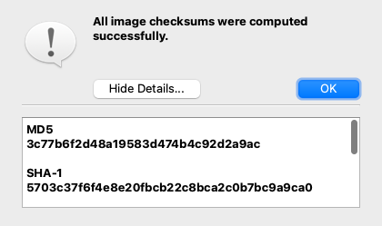

Use SHA-256 or SHA-512 when comparing against a publisher's modern integrity
value. MD5 and SHA-1 are included for compatibility with older published
checksums, not as collision-resistant authenticity proofs.

### Capability Health, inspection, and Secure Boot analysis

Open the sliders/settings toolbar icon to see which backend guarantees and
optional tools are currently available:

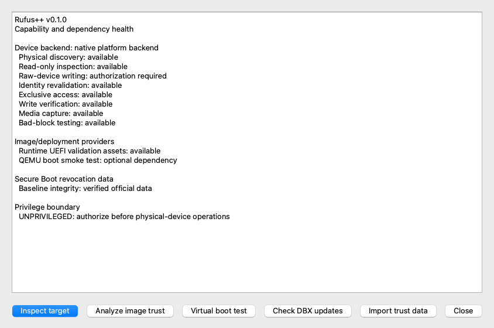

The actions at the bottom provide:

- **Inspect target:** bounded read-only sampling of partition tables, boot
  indicators, and common filesystems.
- **Analyze image trust:** offline inspection of EFI executables against the
  packaged Secure Boot DBX hashes and SBAT generation floors.
- **Virtual boot test:** a read-only QEMU launch smoke test when QEMU and
  suitable firmware are installed.
- **Check DBX updates:** a user-initiated check for newer official Microsoft
  revocation data. No update is downloaded automatically.
- **Import trust data:** loads user-supplied offline text rules or supported EFI
  DBX exports as a clearly marked custom overlay.

Capability Health also shows the exact directory in which deployment receipts
are stored.

### Virtual boot smoke test

For supported ISO and raw images, Capability Health can launch QEMU read-only
and observe it for eight seconds:

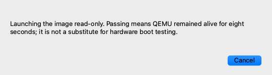

A pass means QEMU stayed alive for the observation window. It does not prove
that the operating system reached its installer, that every boot path works, or
that real firmware and USB controllers will behave the same way.

### Bad-block and fake-capacity testing

Enable **Check device for bad blocks** under advanced format options and choose
one to four passes. This test writes address-dependent patterns across the
entire advertised capacity, flushes them, and reads them back. Address-dependent
patterns can expose both damaged media and counterfeit drives whose high
addresses alias lower physical storage.

This test is destructive even if the subsequent deployment is cancelled.
Multiple passes take longer and add flash wear; use them for device
qualification, not as a routine requirement for known-good media.

## Confirmation, progress, and records

Before a write begins, Rufus++ creates a structured preflight report and opens
a destructive confirmation:

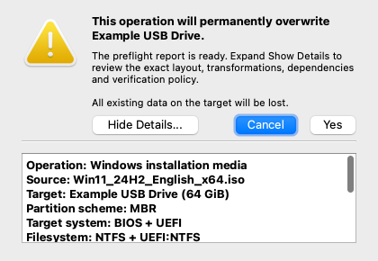

Expand **Show Details** and verify:

- operation and source;
- stable target identity and capacity;
- partition scheme, firmware target, filesystem, and cluster size;
- quick/full policy and verification profile;
- content transformations such as WIM splitting or Linux persistence;
- required providers and their availability;
- warnings and blockers.

**Cancel** is the default. A plan with a blocker cannot reach this confirmation.

During an operation, the progress bar distinguishes staging, writing, clearing
old metadata, verification, and completion. **CANCEL** requests a safe stop;
the current operating-system I/O call may need to return first. If destructive
writing has already started, a cancelled or failed target may contain a partial
image and must not be trusted or booted.

Completed, cancelled, and failed destructive operations create an atomic JSON
receipt. The receipt includes the operation, source, target, result, bytes
written and verified, timestamps, and the source SHA-256 when it was calculated
for the current image. Open Capability Health to locate the host's receipt
directory.

## Troubleshooting

### The device list is empty

- Reconnect the drive and wait up to three seconds for automatic refresh.
- Confirm the operating system sees the device as a whole physical disk.
- Open advanced drive properties only if you need to inspect why a fixed or
  protected disk was excluded.
- A partition, volume, or mounted directory is not a whole-device target.

### START is disabled

Hover over **START** for the immediate reason, then open Capability Health for
provider details. Common causes are:

- no eligible target or analyzed image;
- unprivileged physical-device access;
- an unsupported source/target combination;
- insufficient capacity or unsupported logical-sector geometry;
- a missing NTFS, wimlib, BCD-SYS, DISM, or host formatter dependency;
- a source image stored on the selected target;
- a verification policy that requires complete-device coverage.

### The persistence slider is missing or disabled

The image must contain validated Casper or Debian Live boot entries. Then select
a target large enough to hold 110% of the extracted live payload plus at least
256 MiB of persistence. Keep **ISO image mode (file copy)** selected; persistence
does not apply to exact DD mode.

### Windows To Go is unavailable

Confirm that the ISO contains a valid WIM/ESD edition list and that Capability
Health reports the complete Windows To Go toolchain. The target must have enough
space for the selected edition and the GPT/EFI/NTFS staging layout.

### A Windows customization option is not shown

Options are filtered by the build metadata found inside the Windows image. A
control introduced for Windows 11 is intentionally hidden for Vista, Windows
7, Windows 8.x, and older Windows 10 media where it has no defined effect.

### macOS installer selection or START is unavailable

- The source must be a complete Apple-signed installer application, not a DMG,
  stub downloader, or copied `createinstallmedia` executable.
- The feature is available only on macOS.
- The target must be at least 16 GiB.
- A signed-helper build needs a valid registered helper. An unsigned-root
  development build must be launched through `sudo` to modify a disk.

### NTFS or a host filesystem is absent

Rufus++ lists dependency-gated filesystems only when their complete provider is
available. Install the tools listed in [Features and runtime
requirements](features.md), restart Rufus++, and check Capability Health again.

### Virtual boot testing is unavailable

Install an architecture-compatible QEMU system emulator. UEFI tests also need
a supported read-only OVMF firmware image in a standard location. Compressed
images and virtual-disk containers must be converted or decompressed to a
supported ISO or raw image for this particular test.

### An operation appears stalled

Some unmount, synchronization, formatter, and device I/O calls do not provide
fine-grained progress. Rufus++ warns after 60 seconds without a progress
callback but does not interrupt an in-flight write unsafely. Use **CANCEL** once,
wait for the current call to return, and do not unplug the target while its
activity indicator is active.

## Current limitations

- Physical removable-media qualification and fault-injection coverage are not
  complete; treat all builds as pre-release software.
- Public macOS packages are not yet Developer ID signed and notarized. The
  distributed unsigned-root variant is for controlled testing only.
- Linux and Windows currently use whole-process elevation rather than dedicated
  least-privilege helpers.
- Full Authenticode trust-chain validation, certificate-based DBX matching, and
  Windows SVN analysis are not implemented.
- QEMU testing is a bounded launch smoke test, not a hardware boot test.
- Differencing VHD chains, VHDX images with active logs, uncommon UDF layouts,
  and unknown Linux persistence or legacy Syslinux-only BIOS layouts are
  deliberately restricted instead of guessed.
- Optional workflows remain unavailable until every dependency required by
  that provider is installed.

For the complete feature and dependency inventory, see
[Features and runtime requirements](features.md). For implementation layers and
the destructive-I/O safety boundary, see
[Cross-platform architecture](cross-platform.md).

## Maintaining the screenshots

After changing Qt layouts or user-facing dialogs, rebuild Rufus++ and regenerate
the guide images from the actual widgets:

```console
build/dev/src/qt/Rufus++ --generate-documentation-screenshots docs/assets
```

On macOS, use the executable inside the application bundle:

```console
"build/dev/src/qt/Rufus++.app/Contents/MacOS/Rufus++" \
  --generate-documentation-screenshots docs/assets
```

Screenshot generation uses only fictional in-memory media profiles. It does not
open, read, unmount, format, capture, or write a physical device.
